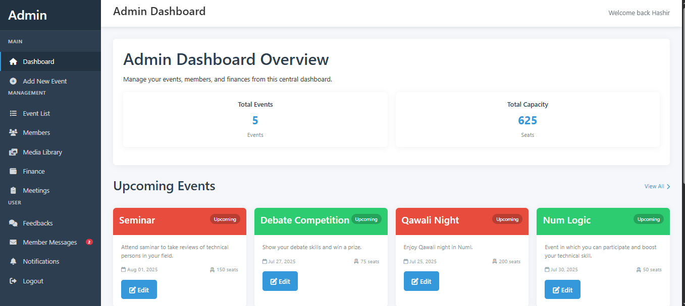
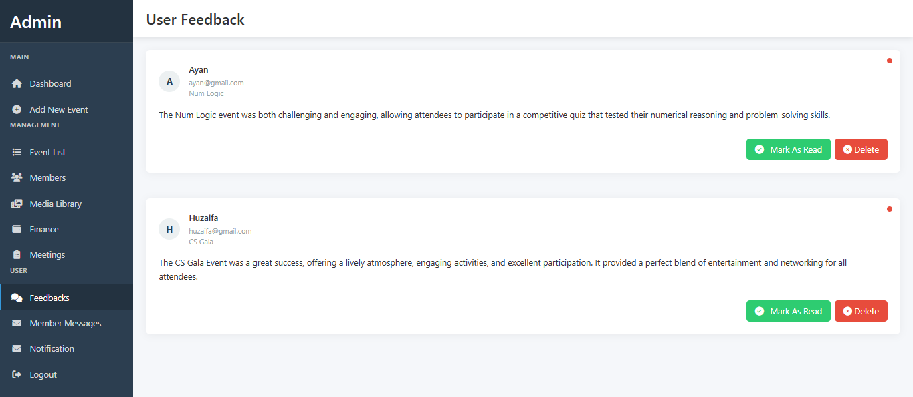

# 🎉 EventHUB - ASP.NET Core MVC Project

**EventHUB** is a web-based event management system developed using **ASP.NET Core MVC**.  
It allows administrators to manage events and members, while enabling members and guests to interact through feedback and registration features.

---

## 📁 Project Structure

EventHUB/ --> Main ASP.NET MVC Project
HelpPage/ --> .NET Class Library (Documentation or API Helpers)
Previews/ --> Screenshots and Preview Images
EventHUB.sln --> Visual Studio Solution File

yaml
Copy
Edit

---

## 🚀 Features

- Admin can add, update, and delete events
- Admin can manage member and meeting information
- Members can send messages to the admin
- Event registration for users
- Feedback system

---

## 🖼️ Preview

| Dashboard | Event List |
|----------|------------|
|  |  |

> 📌 Add more images to the `Previews` folder and reference them here.

---

## 📦 Technologies Used

- ASP.NET Core MVC
- Entity Framework
- SQL Server
- Bootstrap
- Razor Views
- Visual Studio 2022

---

## 🛠️ How to Run

1. Clone the repo
2. Open `EventHUB.sln` in Visual Studio
3. Restore NuGet packages
4. Build and Run the project
5. Use SQL Server to set up the database (if needed)

---

## 🔗 License

This project is open-source and available under the MIT License.
